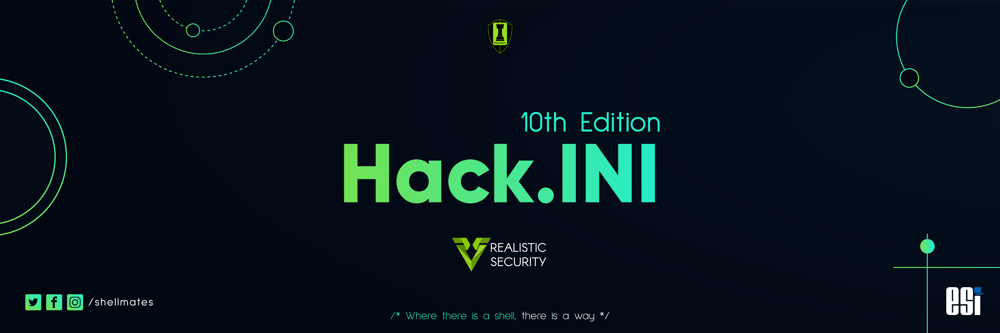

# HackINI-2k22 ctf challenge write-ups
Write-ups of the challenges I solved in the HackINI-2k22 ctf challenge



<!-- TABLE OF CONTENTS -->
## Table of Contents

* [Format](#format)
* [License](#license)
* [Credits](#credits)

## Format

```
- Repo
  - forensics
    - lies                    # description
    - smurf                   # description
  - jail
    - jsandboxs               # description
    - less                    # description
  - linux
    - diff                    # description
    - nutshell1               # description
    - nutshell2               # description
    - nutshell_supreme        # description
    - remote                  # description
    - welcome                 # description
  - web
    - whois                   # description
    - whois-fixed             # description
  - AUTHORS
  - LICENSE
  - banner.png
  - README.md
```

## License
- Please read HackINI-2k22/LICENSE.
- If you're too lazy to read, do anything you want with this project and don't forget to give credits to me 'nemo256', this repo link or to the team 'AnonyBlasBlas' as it is much appreciated.

## Credits
- Thank you to shelmates https://ctf.shellmates.club/ for organizing this event.
- Thank you to all the AnonyBlasBlas team members for participating.
