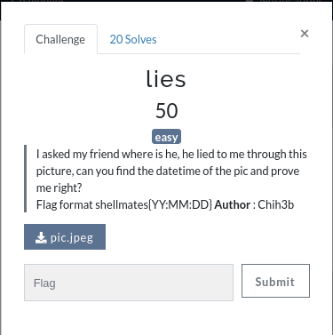

# Lies

Challenge description:
forensics/lies



This challenge is very easy.

## Step 1
- Since they provide a picture (pic.jpeg), the most obvious thing to do is to just extract information from it.
- Using the strings command to print anything that has more than 10 characters in a file:
```
$ strings -10 pic.jpeg
```
- The command will print out the following


- Now, the date is shown in the list of strings, which is the answer.
```
shellmates{2021:10:25}
```
