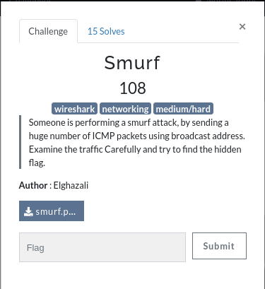
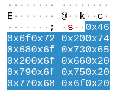
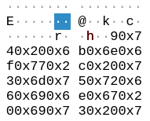

# Smurf

Challenge description:
forensics/smurf



This challenge is relatively easy.

## Steps
- Downloading the provided file (smurf.pcapng) and opening it in wireshark.
- Just from analyzing the ascii codes of each packets, we can see a pattern showing s->h->e->l..., as it is shown in the images below:




- Now, from the pattern we find: 

```
shellmates{y0u_4r3_th3_5murf_ch4mp}
```
