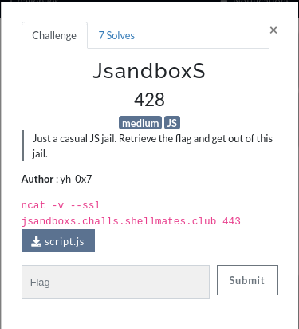
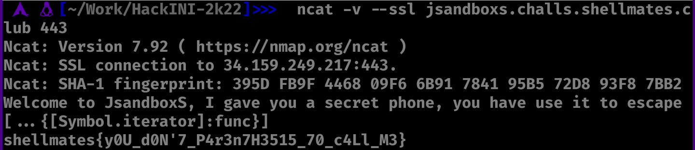

# JsandboxS

Challenge description:
jail/jsandboxs



This challenge is relatively easy, depending on your javascript skills.

## Step 1
- Downloading the provided script.js and reading it.
- From reading the code, we can figure out that the input gets evaluated using the function eval(), and we can inject our code here.
- And the injected code has to call that func function because it logs the ./.passwd file (the flag).
- But the input is restricted, it cant be one of any of these characters:
```
"0123456789!\"#$%&'()*+-/;<>?@\\^|~\t\n\r\x0b\x0c "
```
- From that blacklist we can see that the characters ,.:{}[] are not blacklisted
- Now from searching on google, we can find multiple ways of calling a function, and this is one of them that does not have the blacklisted characters:
```
> [...{[Symbol.iterator]:func}]
```

- Now, the date is shown in the list of strings, which is the answer.


```
shellmates{good_job_you_found_the_flag}
```
