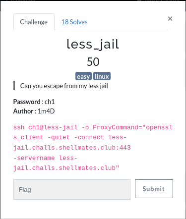
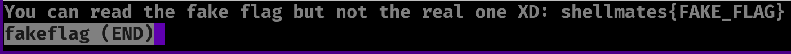
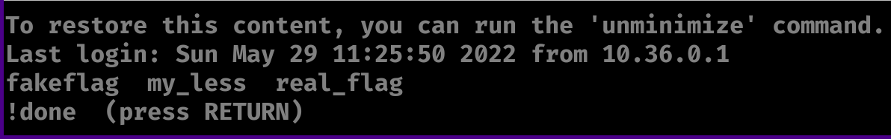
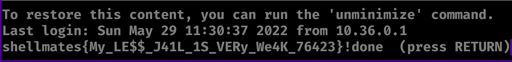

# Less jail

Challenge description:
jail/less



This challenge is relatively easy, depending on your linux knowledge.

## Step 1
- Accessing the provided ssh link will get us presented with this fake flag:



## Step 2

- Now this is the easy part, we can run any command using '!' characters:
- ls to check for list of files:



- After running ls, we can see 2 files provided fakeflag and real_flag, so just using cat to print real_flag:


- Here is the resulted flag:



```
shellmates{My_LE$$_J41L_1S_VERy_We4K_76423}
```
