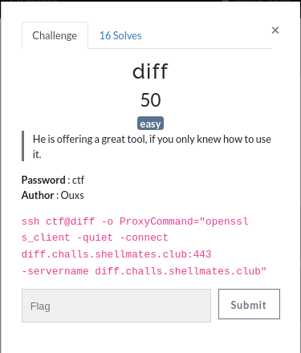

# Diff

Challenge description:
linux/diff



This challenge is easy, especially for linux geeks.

## Step 1
- Accessing the provided link and printing the list of files using ls:


- We can see flag.txt but it we only have permission to run diff using ctf-cracked user as it is shown here:


## Step 2
- Now we run the diff command on flag and any file that has read permissions using the ctf-cracked user:


- Now, the flag is printed like this:

```
shellmates{You_ma$tered_th3_t00L}
```
