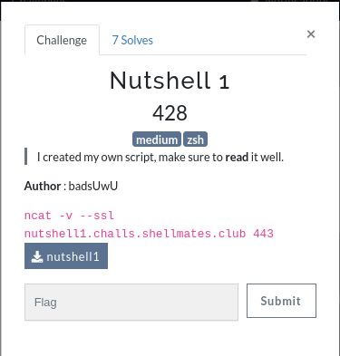
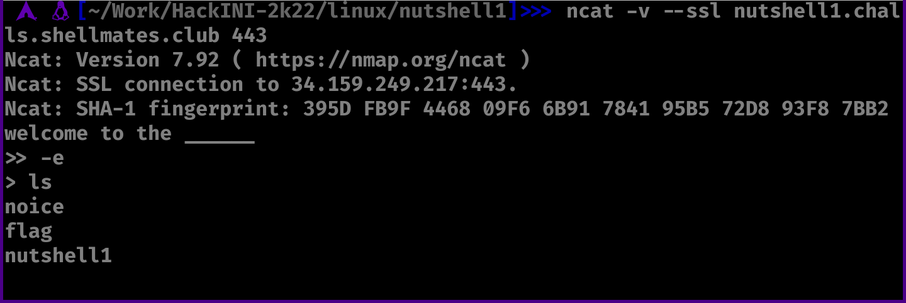
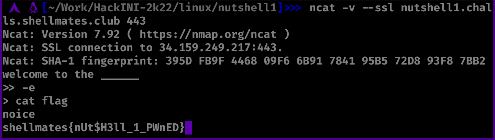

# Nutshell1

Challenge description:
linux/nutshell1



This challenge is easy/medium, depending on your linux knowledge.

## Steps
- From reading the provided file (nutshell1) script, we can see that it is a zsh script and has a double read through 2 variables, so the idea is to inject code to the second variable ($v2) which then gets executed.
- From reading the zsh docs, we can escape echo command using -e flag, so injecting -e in the first variable, and then, our command through the second variable:



- After running the ls command, we can see the flag, in the next step we just cat the flag.



```
shellmates{nUt$H3ll_1_PWnED}
```
