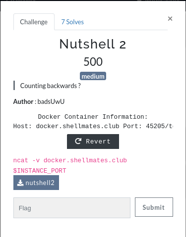
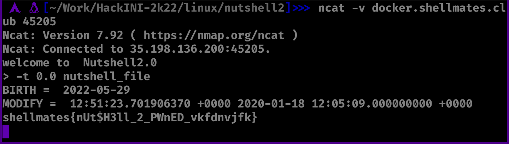

# Nutshell2

Challenge description:
linux/nutshell2



This challenge is easy/medium, depending on your linux knowledge.

## Steps
- From reading the provided file (nutshell2) script, we can see that it has two conditions, first one checks for nutshell_file if it exists.
- The touch command creates a file from the user input ($v1), and then we have to modify the BIRTH date of that file.
- From reading the manual page of the touch command we find the flag -t which we use to modify the BIRTH date of the nutshell_file.



- The flag is printed to the screen.

```
shellmates{nUt$H3ll_2_PWnED_vkfdnvjfk}
```
