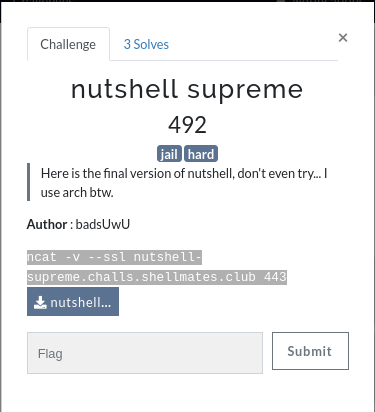

# Nutshell Supreme

Challenge description:
linux/nutshell_supreme



This challenge is relatively hard, because it has many steps but with good hints.

## Step 1
- From reading the provided file (nutshell_supreme) script, it has the same double read from nutshell1 [Nutshell1](../nutshell1/).
- First hint is using zsh and echo, because we can escape sequences as shown in this link [Echo-ZSH](https://unix.stackexchange.com/questions/88307/escape-sequences-with-echo-e-in-different-shells),
- We can match the given regex "^[a-z0-9A-Z\\]+$" to get through the first condition to pass it.
- Then, the second obstacle is getting through the sl command, sl was created for users to display animations aimed to correct users who accidentally enter sl instead of ls.
- The problem with the sl command is that it always returns an error code (1) (debugged using echo $? to print last return value).
- From reading about sl command, it has a flag '-v' that prints the version and returns a success code (so that the 'cat flag' command gets executed)
- '-e' in echo command is not POSIX compliant, we can inject escape sequences like \055 which is '-'.
- Now we can inject \\055v which is '-v' into the second variable to cat the flag.


- The flag is printed to the screen.

```
shellmates{nUt$H3ll_supreme_good_job_12345}
```
