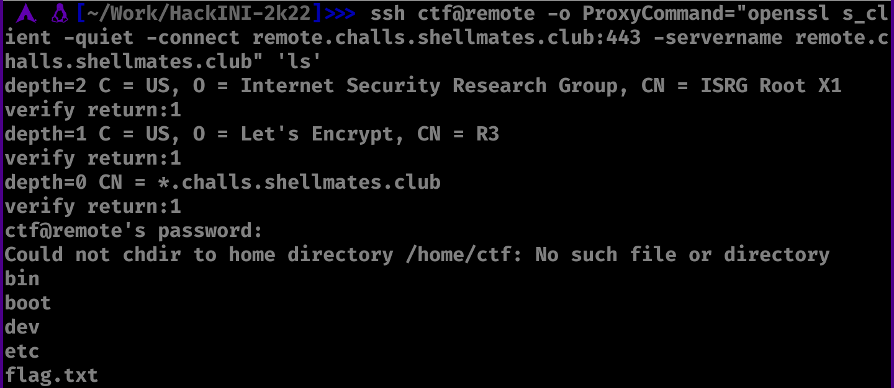
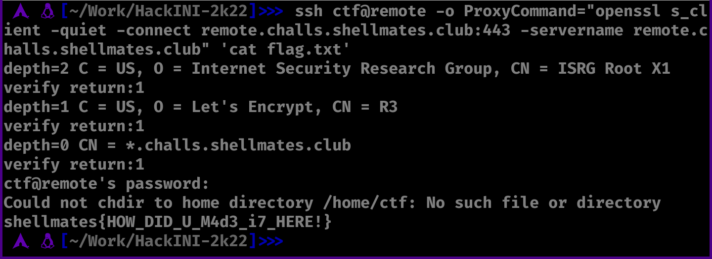

# Remote

Challenge description:
linux/remote


This challenge is easy.

## Steps
- Running the given ssh command will print a GOODBYE message.


- We can get through this by just passing commands to ssh like this: eg: ssh ... 'command'
- Running ls will find the flag.txt directly.



- Now, just printing the flag using the cat command.



- The flag is:
```
shellmates{HOW_DID_U_M4d3_i7_HERE!}
```
