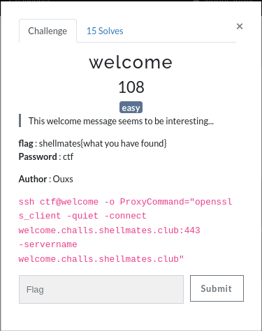

# Welcome

Challenge description:
linux/welcome



This challenge is very easy.

## Step 1
- Running the given ssh command will print a welcome screen showing this:


- I found the file that updates MOTD the message of the day (which is the welcome screen in the first image)

- Just printing it will show this:


- Which is the interesting thing (the flag):
```
shellmates{f379bbf265604f3514cda4aadbc05137}
```
