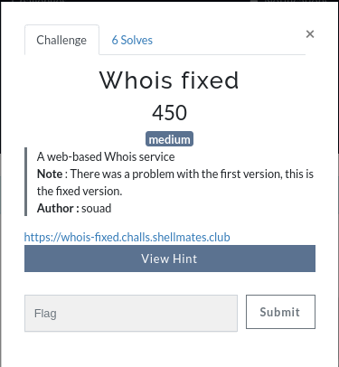
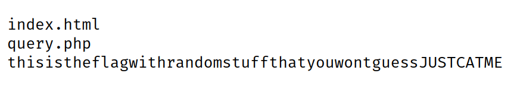

# Whois-fixed

Challenge description:
web/whois-fixed



This challenge is medium level.

## Steps
- The same steps from [Whois](../whois) to reproduce the exploit.
- The only difference is that the flag's name is different, ls will output this:



- Then, just printing the file 'thisistheflagwithrandomstuffthatyouwontguessJUSTCATME' will output the flag:
```
shellmates{i_$h0U1D_HaVE_R3AD_7HE_dOc_W3Ll_9837432986534065}
```
