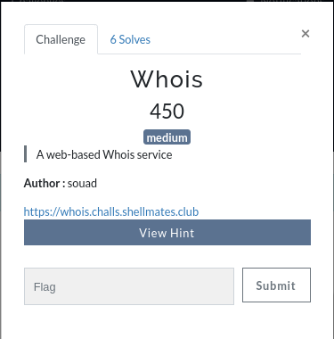

# Whois

Challenge description:
web/whois



This challenge is medium level.

## Steps
- From visiting the provided link and checking the code of query.php, we can see that host and query variable get regex matched.
- And we have to escape that regex to finally run the command 'whois -h ${host} ${query}'.
- So, the idea is to escape host's regex to inject our code in the query variable.
- We can escape on the host variable using %0A which is \n to execute the query variable as any command.
- Running the ls command:


- Then, just printing the flag.txt file:


- Just printing it will show us the flag:
```
shellmates{i_$h0U1D_HaVE_R3AD_7HE_dOc_W3Ll}
```
